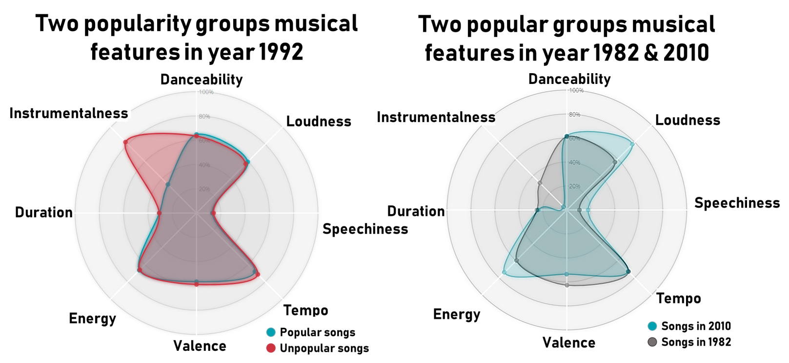

# Evaluating Musical Trends through custom defined popularity
## Summary
Through this project, we are investigating a temporal evolution of musical popularity through custom-defined popularity groups and inherent musical features within each of the group. We are analyzing to observe if there is a significant trend (either a rise or a  fall) of musical features from 1980s to 2020. From the interactive radar plot and classical machine learning, we conclude that **there is NO significant musical feature that governs the trend from 1980 to 2020.** It is interesting to see that our own definition of **musical popularity was correlated not to inherent musical features but artists name.** This shows that the musical trend was more or less inluenced by *Who* produced *What* instead of *What* was produced. 
## Motivation and Distinction
Many research groups including social sciences, computer science, and even musical industry leaders have tackled to analyze the musical trends in a variety of perspectives through means of social surveys and artificial intelligence. Only few have dived into temporal aspects of musical trends through musical feature-based popularity. In this project, a new approach is suggested by 
1. Providing a custom definition of a musical popularity based on duration of awareness (how long people have recognized a music within an album as popular)
2. Interactively visualizing musical features based on custom defined popularity groups
3. Building classical machine learning models to distinguish governing musical features

## Our Definition of Popularity

When coming up with the defintion of popularity, we asked ourselves what quantifies a song to be popular? It can be how many times people have listened to the song. It also can be how many times it has been discussed within a social media. We decided that each of these metrics will have a varied measure based on the source. Thus, we focused more on the duration of the song staying within a ranking chart. That is, the longer a song stays within a top rank, the more popular the song will be within the musical industry. Now, there are some extreme cases in which the song could be on the 100th rank for a quarter of a year or be on the top 5 rank for only few weeks. We took the number of times a song appeared in a weekly Hot 100 Billboard chart and plotted the cumulative distriution. The number of weeks that corresponds to the 50% of the cumulative distribution was set as the threshold for dividng the popular to nonpopular group. 

## Data Collections and Manipulation

Using Billboard Hot 100 API (https://github.com/guoguo12/billboard-charts), we scraped hot 100 charts weekly starting from the year 1980. Song artists and name were sometimes not identical between two sources. Thus, iterations of regular expressions and manual review were used to fill the missing information. Despite this method, some of the musics which were not present in Spotify source were omitted from the analysis. Given the song name and artists group from Billboard Hot 100, the musical features are pulled from Spotify API. Each weekly data are aggregated yearly and divided between popular and non-popular group using the popularity definition. 

## Exploratory Data Analysis using a Radar Plot

## ML Model on Popularity

